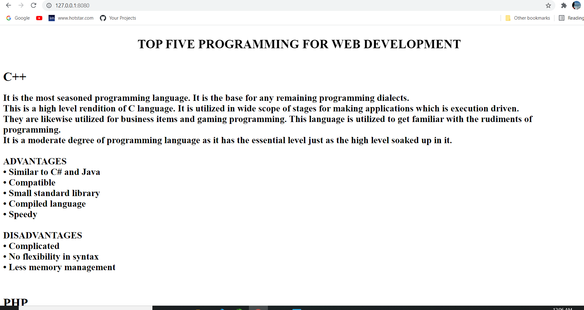
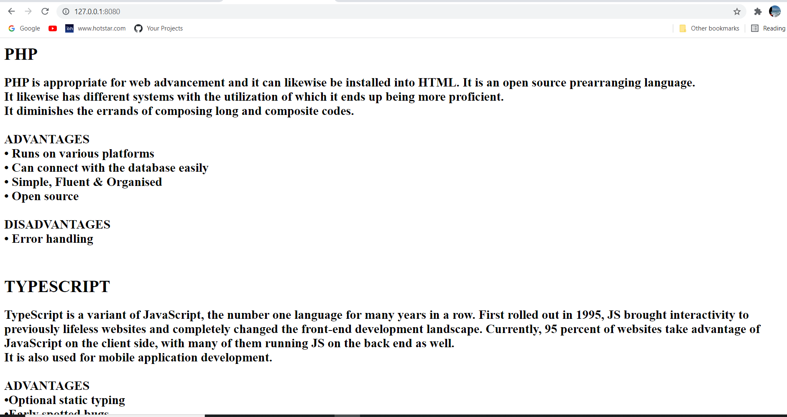
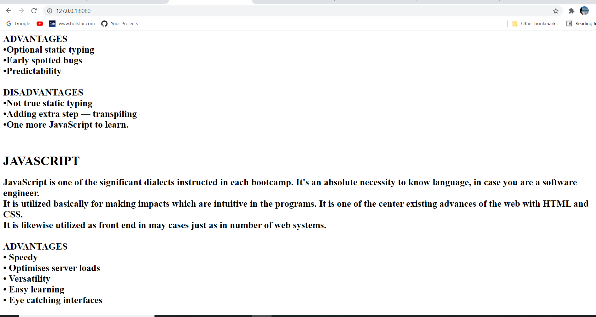
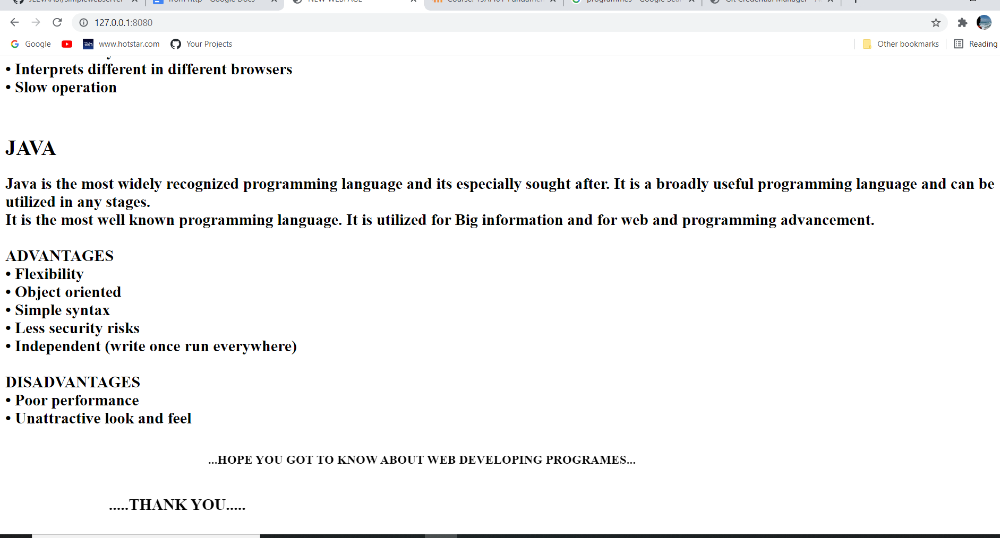
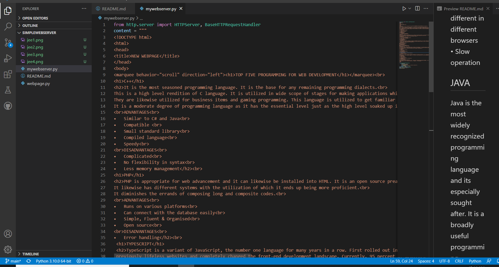
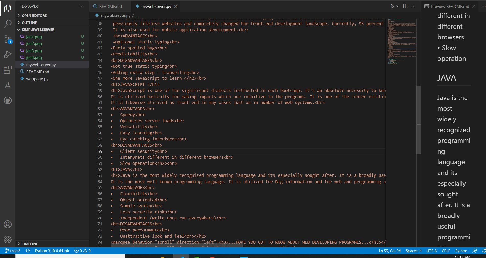
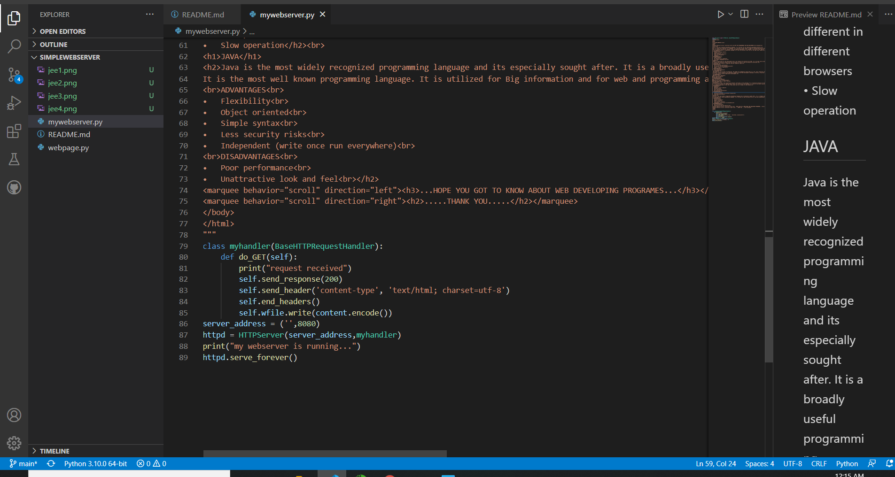

## Developing a Simple Webserver
## AIM:
To develop a simple webserver to display about top five programming languages

## DESIGN STEPS:
### Step 1:
HTML content creation
### Step 2:
Design of webserver workflow
### Step 3:
Implementation using Python code
### Step 4:
Serving the HTML pages.
### Step 5:
Testing the webserver

## PROGRAM:
```
from http.server import HTTPServer, BaseHTTPRequestHandler
content = """ 
<!DOCTYPE html>
<html>
<head>
<title>NEW WEBPAGE</title>
</head>
<body>
<marquee behavior="scroll" direction="left"><h1>TOP FIVE PROGRAMMING FOR WEB DEVELOPMENT</h1></marquee><br>
<h1>C++</h1>
<h2>It is the most seasoned programming language. It is the base for any remaining programming dialects.<br>
This is a high level rendition of C language. It is utilized in wide scope of stages for making applications which is execution driven.<br>
They are likewise utilized for business items and gaming programming. This language is utilized to get familiar with the rudiments of programming.<br>
It is a moderate degree of programming language as it has the essential level just as the high level soaked up in it.<br>
<br>ADVANTAGES<br>
•	Similar to C# and Java<br>
•	Compatible <br>
•	Small standard library<br>
•	Compiled language<br>
•	Speedy<br>
<br>DISADVANTAGES<br>
•	Complicated<br>
•	No flexibility in syntax<br>
•	Less memory management</h2><br>
<h1>PHP</h1>
<h2>PHP is appropriate for web advancement and it can likewise be installed into HTML. It is an open source prearranging language.<br>
It likewise has different systems with the utilization of which it ends up being more proficient.<br>
It diminishes the errands of composing long and composite codes.<br>
<br>ADVANTAGES<br>
•	Runs on various platforms<br>
•	Can connect with the database easily<br>
•	Simple, Fluent & Organised<br>
•	Open source<br>
<br>DISADVANTAGES<br>
•	Error handling</h2><br>
 <h1>TYPESCRIPT</h1>
 <h2>TypeScript is a variant of JavaScript, the number one language for many years in a row. First rolled out in 1995, JS brought interactivity to<br>
 previously lifeless websites and completely changed the front-end development landscape. Currently, 95 percent of websites take advantage of JavaScript on the client side, with many of them running JS on the back end as well.<br>
 It is also used for mobile application development.<br>
 <br>ADVANTAGES<br>
 •Optional static typing<br>
•Early spotted bugs<br>
•Predictability<br>
<br>DISADVANTAGES<br>
•Not true static typing<br>
•Adding extra step — transpiling<br>
•One more JavaScript to learn.</h2><br>
<h1>JAVASCRIPT </h1>
<h2>JavaScript is one of the significant dialects instructed in each bootcamp. It's an absolute necessity to know language, in case you are a software engineer.<br>
It is utilized basically for making impacts which are intuitive in the programs. It is one of the center existing advances of the web with HTML and CSS.<br>
It is likewise utilized as front end in may cases just as in number of web systems.<br>
<br>ADVANTAGES<br>
•	Speedy<br>
•	Optimises server loads<br>
•	Versatility<br>
•	Easy learning<br>
•	Eye catching interfaces<br>
<br>DISADVANTAGES<br>
•	Client security<br>
•	Interprets different in different browsers<br>
•	Slow operation</h2><br>
<h1>JAVA</h1>
<h2>Java is the most widely recognized programming language and its especially sought after. It is a broadly useful programming language and can be utilized in any stages.<br>
It is the most well known programming language. It is utilized for Big information and for web and programming advancement.<br>
<br>ADVANTAGES<br>
•	Flexibility<br>
•	Object oriented<br>
•	Simple syntax<br>
•	Less security risks<br>
•	Independent (write once run everywhere)<br>
<br>DISADVANTAGES<br>
•	Poor performance<br>
•	Unattractive look and feel<br></h2>
<marquee behavior="scroll" direction="left"><h3>...HOPE YOU GOT TO KNOW ABOUT WEB DEVELOPING PROGRAMES...</h3></marquee><br>
<marquee behavior="scroll" direction="right"><h2>.....THANK YOU.....</h2></marquee>
</body>
</html>
"""
class myhandler(BaseHTTPRequestHandler):
    def do_GET(self):
        print("request received")
        self.send_response(200)
        self.send_header('content-type', 'text/html; charset=utf-8')
        self.end_headers()
        self.wfile.write(content.encode())
server_address = ('',8080)
httpd = HTTPServer(server_address,myhandler)
print("my webserver is running...")
httpd.serve_forever()
```


## OUTPUT:

## Client Side Server:









## Server side:







## RESULT:

Since i created simple webserver with help of HTML programming language,about five programming languages as a content. Thus the program ran sucessfully.

